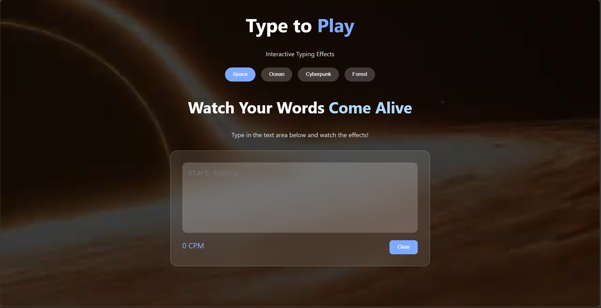
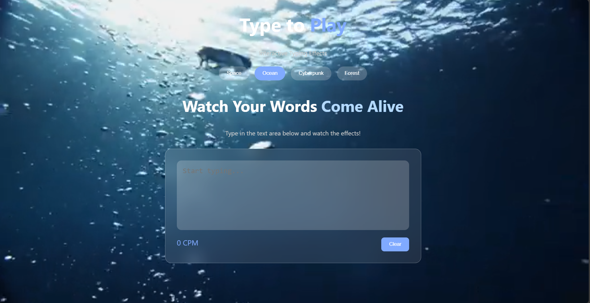
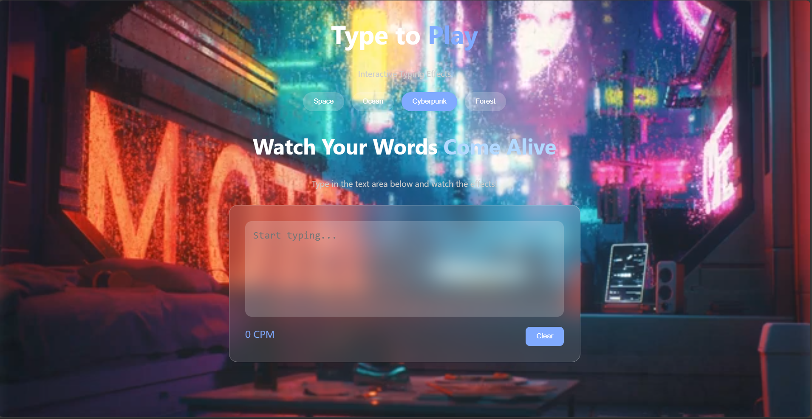

---
# 🚀 DEVX: CODE. CREATE. CONQUER


## 👨‍💻👩‍💻 Team Name - ErrOr404

## 🛠️ Tech Stack Used
- HTML
- CSS
- JavaScript


## Problem Statement
##  ⌨️ Type to Play – Interactive Typing Effects  
Make typing an **immersive and dynamic** experience! Whether it's a game, interactive art, or a story that unfolds as you type, bring creativity to every keystroke.  

### 🎯 Features  
- 🎭 **Real-time Typing Effects** – Watch the UI change with every keystroke.  
- 🎮 **visual and interactive** - Experience should include either of these: Animations, sound effects, or changing UI elements 

## ⚙️ Setup Instructions (if applicable)
1. Clone the repository:
    ```bash
    git clone https://github.com/your-repo-link.git
    ```
2. Navigate to the project directory:
    ```bash
    cd your-repo-folder
    ```
3. Open the `index.html` file in your browser.

## ✨ Features Implemented
- Responsive design using HTML and CSS.
- Interactive UI components with JavaScript.
- Cross-browser compatibility.
- User-friendly navigation.
- Pronounces the Text for learning.
- Different Themes for User favors.
- Each theme has its own typing tones

Feel free to explore, contribute, and raise issues if you find any bugs or have suggestions for improvements!

---

### 📬 Contact
For any queries, contact the team at [Mail](mailto:anushrithvic.com).






